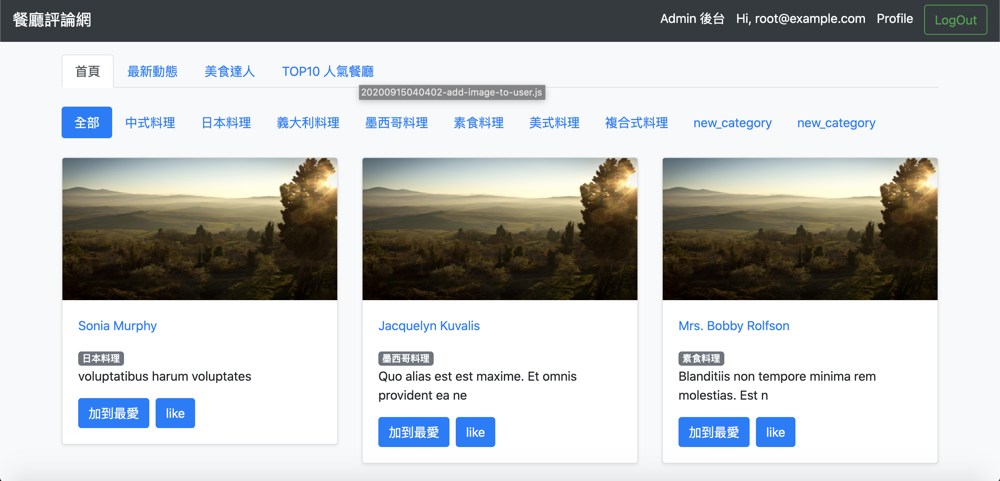
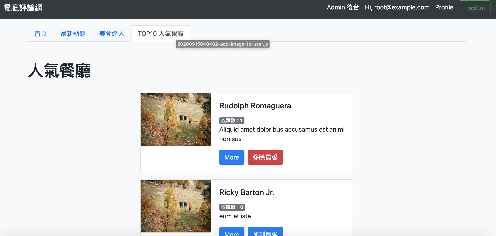
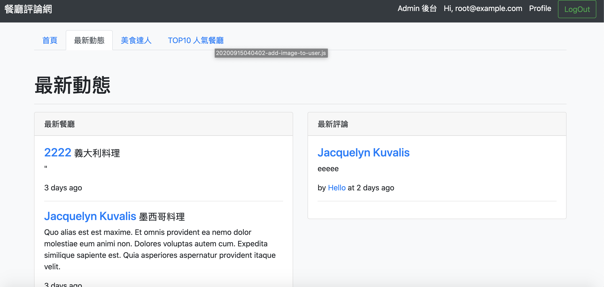

# 餐廳論壇

##網站功能
- 管理員可以登入後台新增/修改/刪除餐廳資料
- 管理員可以登入後台新增/修改/刪除餐廳分類
- 管理員可以登入後台修改使用者權限
- 使用者可以修改個人簡介
- 使用者可以查看其他使用者個人簡介
- 使用者可以追蹤其他使用者
- 個人簡介包含:評論餐廳、收藏餐廳、追蹤的使用者、追蹤自己的使用者
- 使用者可以篩選餐廳分類
- 使用者可以加入/移除最愛餐廳至收藏清單
- 使用者可以Like/Unlike餐廳
- 使用者可以評論餐廳
- 使用者可以查看最新動態資訊
- 使用者可以點選Top10人氣餐廳查看收藏數高的餐廳
- 使用者可以點選美食達人查看追蹤人數高的使用者

## 安裝方式
- 將專案clone到本地端
`https://github.com/calvinsungvin/restaurant_forum.git`
- 進入專案資料夾，並下載package
`cd restaurant_forum` &
`npm install`
- Workbench新增和使用database
`CREATE DATABASE forum` & `use forum`
- 匯入遷徙檔案
`npx sequelize db:migrate`
- 匯入種子資料
`npx sequelize db:seed:all`
- 透過nodemon啟動專案
`npm run dev`
- 在terminal可以看到 Express is listening on localhost : 3000，開啟瀏覽器在網址列輸入localhost:3000

## 測試帳號
| Account | Password |
| ------ | ------ |
| root@example.com | 12345678 |
| user1@example.com | 12345678|
| user2@example.com | 12345678 |

## 開發環境
1. bcryptjs: 2.4.3
2. body-parser: 1.19.0
3. connect-flash: 0.1.1
4. dotenv: 8.2.0
5. express: 4.17.1
6. express-handlebars: 5.0.0
7. express-session: 1.17.1
8. method-override: 3.0.0
9. mongoose: 5.9.25
10. multer: 1.4.2
11. passport: 0.4.1
12. passport-facebook: 3.0.0
13. passport-local: 1.0.0
14. Node.js: 10.15.0
15. mysql2: 2.1.0
16. sequelize: 6.3.5
17. sequelize-cli: 6.2.0

## 截圖

